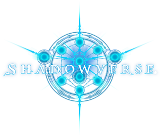
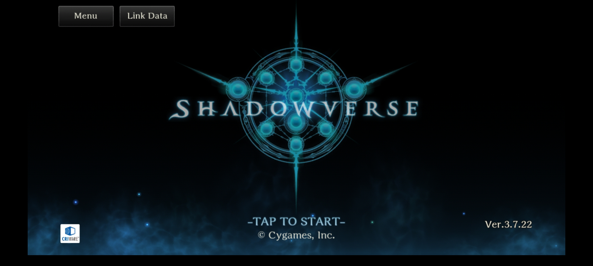
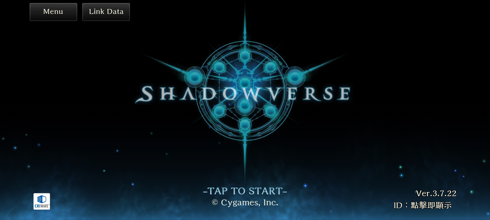

    
  <h1>Shadowverse HD</h1>

[English](readme_en.md)

[影之诗](https://shadowverse.com/)非官方安卓客户端。解除了原版的分辨率限制，并对全面屏进行适配。

新版本发布时，（如果不出意外）在 Playstore 官方版本更新后的30分钟内，本项目会自动进行更新适配。

官方客户端:

本项目提供的客户端:

## 免责声明
Shadowverse 是 Cygames, Inc. 的注册商标。

本项目提供的客户端在官方客户端的基础上修改而成。我们不对使用本项目提供的客户端所造成的任何问题/后果负责。

## Credits

[Apktool](https://github.com/iBotPeaches/Apktool)

[89z's googleplay](https://github.com/89z/googleplay)

[[授人以渔]影之诗安卓客户端解锁60帧以及高分辨率的简单修改方法](https://ngabbs.com/read.php?tid=18370582)

[[国际服] 高清客户端修改流程分享](https://ngabbs.com/read.php?tid=30065561)
