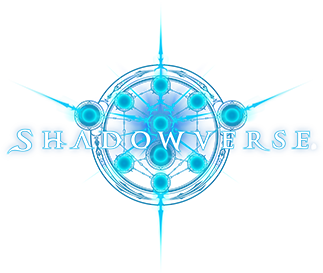
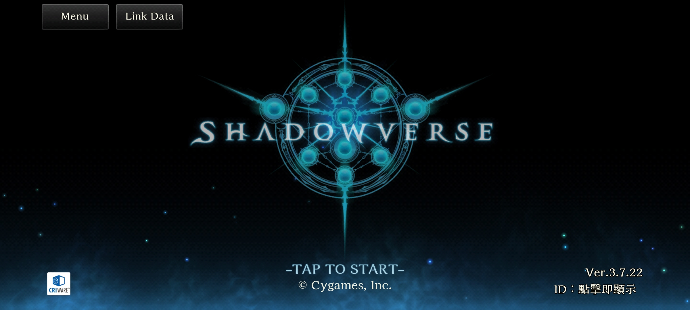

    
  <h1>Shadowverse HD</h1>

[中文](readme_zh.md)

[Shadowverse](https://shadowverse.com/) unofficial android client. The resolution limitation of the original version has been removed, and the full screen has been adapted.
The new version will be automatically updated within thirty minutes of the playstore update.

Before:

After:

## Disclaimers
Shadowverse and the Shadowverse logo are trademarks of Cygames.

This project is modified from the official client. We are not responsible for any problems caused by using the client provided in this project.

## Credits

[Apktool](https://github.com/iBotPeaches/Apktool)

[89z's googleplay](https://github.com/89z/googleplay)

[[授人以渔]影之诗安卓客户端解锁60帧以及高分辨率的简单修改方法](https://ngabbs.com/read.php?tid=18370582)

[[国际服] 高清客户端修改流程分享](https://ngabbs.com/read.php?tid=30065561)
